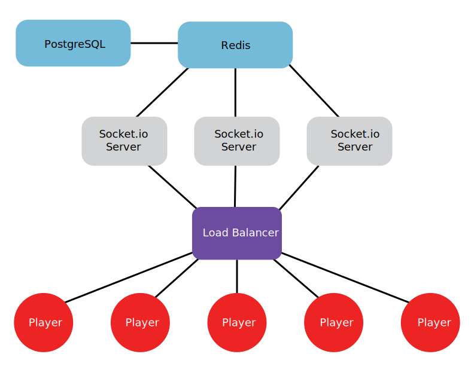

# Matchmaking Service

This is a NodeJs, Socket.io, and PostgreSQL implementation of a 1v1 matchmaking server. Mocha is used for testing. Opponents are matched based on Matchmaking Rating (MMR) and location. 

## Matchmaking algorithm
At a set interval:
1) The server finds all players in the database who are in the queue. 
2) For each pair of matches, a "goodness of match" (GOM) can be calculated between two players, taking into account MMR and location. Both of these attributes are weighted. A simple GOM equation is used:

    `GOM = weightMMR * differenceInMMR + weightDistance * distanceBetweenPlayers`
    
    Distance is taken into account during matchmaking to mitigate lag during the match. In production, the distance between the players and the server is more important than the distance between the two players. Instead of generating server locations, the distance between the two players was used as an approximation.
    
    The weights on the difference in MMR and distance correspond to the importance of the attribute in matchmaking. In this case, the weight on MMR is set higher than the weight on distance, since generally it is more important for the players to be close in MMR than close in distance. More attributes such as win/loss ratio, user reputation and the number of games played can be taken into account easily by adding more terms to the equation.

3) The GOM is then compared to a threshold. The threshold increases as the time both players have been in the queue increase, this way players do not spend to long in the queue.
4) If GOM < threshold, then the match is made. 

## To use:
1) `git clone https://github.com/marshalladam/MatchmakingServer`
2)  Setup a local or hosted testing database and enter your credentials in config/config.json
3) `npm install`
4)  Run `sequelize db:migrate` to create the tables
5)  Run `sequelize db:seed:all` to seed the database
6) `nodemon`
7) Go to localhost:2522
8) "Valid" usernames include: 'bluefrog786', 'tinymouse526', 'sadbutterfly417', 'greenmeercat893', 'tinybutterfly958', 'fastcar753', 'greenostrich159', 'bluedog194' and 'organgegiraffe786'. Entering usernames not in this list will alert client that user is not found. Enter the username and then press enter. Now you are in the lobby.
9) Press "enter queue" button to enter queue.
10) Repeat in new tab with different username
11) When matched, clients will be alerted that a game has been made

## To run tests:
1) `npm install`
2) start server in one terminal: `nodemon`
3) run tests in new terminal: `mocha -R spec`

## Scalability

  

For scalability, there would N processes all listening on the same port and there would be a [load balancer](https://socket.io/docs/using-multiple-nodes/) to distribute the load among them. This makes the server infrastructure transparent to the clients, which means you can scale the servers up or down without changing the client behavior at all. 

Additionally, we could use a keystore database (Redis) for storing queued players. There is [a socket.io-redis library](https://github.com/socketio/socket.io-redis) that allows you to run multiple socket.io instances and communicate with and between any of them regardless of process.

Players could also be separated into bins based on MMR. A process could run for each bin, looking for matches. If certain bins do not result in matches for a certain period of time, they can be merged with the bin “above” or “below” them to increase the pool of players. Conversely, if the number of players in a bin reaches a certain capacity, the bin could split into two bins to reduce load (i.e. split a bin with MMR range of (750-1000) to two bins with ranges (750-874) and (875-1000). 

## Future additions
* After match is completed, MMR's for both players are recalculated.
* Expand from 1v1 to team based matches
* An API that can be called upon instead of direct GUI interactions.

